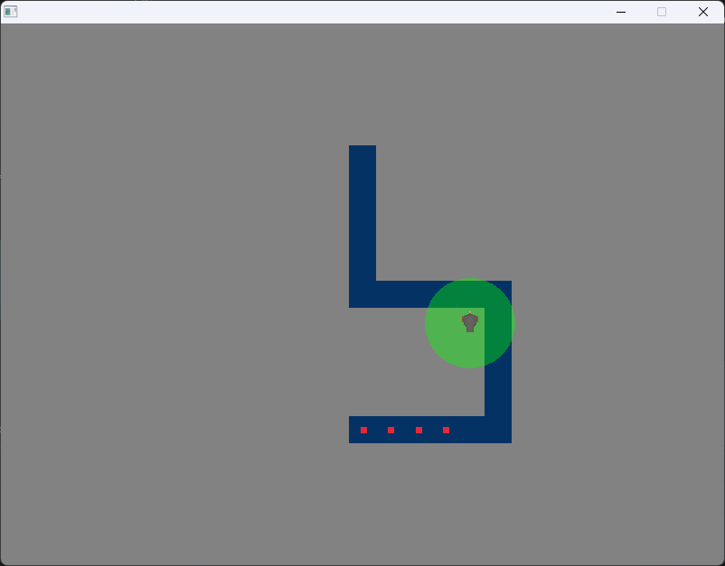
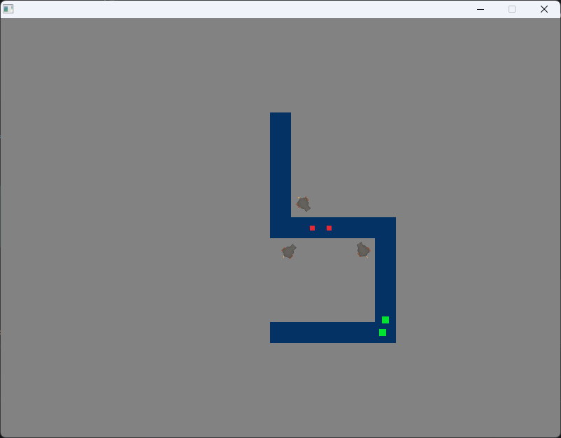

# Raylib Tower Defense

## Project Description
This project was created to learn and practice using C++ 20 by creating a game using the [Raylib](https://www.raylib.com/) graphics library with data and object-oriented programming.
The goal of this game is to prevent the enemies reaching the end of the path by placing towers which will shoot at them.

## Screenshots



## Build Instructions
### Requirements
* CMake 3.11+
* Visual Studio with MSVC (VS 2019+)

### Process
1. Clone the repository - https://github.com/karlkost/raylib_TowerDefense
2. Then use these terminal commands to build
```bash
cd raylib_TowerDefense
mkdir build
cd build
cmake ..
cmake --build .
```
3. After it's done building run the game by entering these commands
```bash
cd Debug
.\raylib_TowerDefense.exe
```

## Controls & Info
- Press **1** to equip/unequip a tower and **Left Click** to place when equipped, the circle around the tower represents the range of the tower
  - Green shows that current position is a valid spot to place
  - Red shows that current position is an invalid spot
- There are currently 3 enemies and 5 waves in the game

## Future Additions
- Bullets when the tower shoots
- Visual confirmation that enemy takes damage (health bar or particles)
- Win/Lose Screen
- Currency to gain & use
- Towers Expansion
  - More Towers
  - Tower Upgrades
  - Tower Targeting (First, Last, Strong, Close)
- User Interface
  - Wave Number & Coins
  - Available Towers
  - Tower Screen (for selected tower to see upgrades, targeting, and stats)
